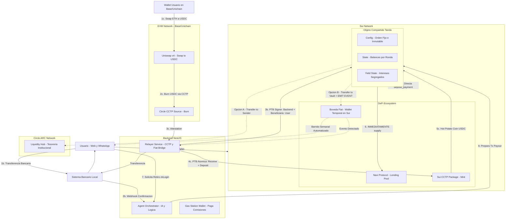

```mermaid
graph TD
    %% --- ACTORES EXTERNOS ---
    User[Usuario - Web y WhatsApp]
    Bank[Sistema Bancario Local]
    EVM_Wallet[Wallet Usuario en Base/Unichain]

    %% --- INFRAESTRUCTURA OFF-CHAIN ---
    subgraph Backend_Infrastructure [Backend NestJS]
        AgentBE[Agent Orchestrator - IA y Logica]
        GasStation[Gas Station Wallet - Paga Comisiones]
        RelayerService[Relayer Service - CCTP y Fiat Bridge]
    end

    %% --- BLOCKCHAINS EXTERNAS ---
    subgraph EVM_Network [EVM Network - Base/Unichain]
        Uniswap[Uniswap v4 - Swap to USDC]
        CCTP_Source[Circle CCTP Source - Burn]
    end

    subgraph Circle_Arc [Circle ARC Network]
        LiquidityHub[Liquidity Hub - Tesoreria Institucional]
    end

    %% --- SUI NETWORK ---
    subgraph SUI_Network [Sui Network]
        
        subgraph Tanda_Object [Objeto Compartido Tanda]
            Config[Config - Orden Fijo e Inmutable]
            State[State - Balances por Ronda]
            Yield_State[Yield State - Intereses Segregados]
        end
        
        subgraph SUI_DeFi [DeFi Ecosystem]
            Navi[Navi Protocol - Lending Pool]
            SUI_CCTP[Sui CCTP Package - Mint]
            Vault[Boveda Fiat - Wallet Temporal en Sui]
        end
    end

    %% ==========================================
    %% FLUJO DE ENTRADA (DEPOSITOS)
    %% ==========================================

    %% CASO 1: PAGO NATIVO SUI
    User -- 1a. Paga con Sui Wallet --> SUI_Network
    SUI_Network -.->|Llamada Directa deposit_payment| Tanda_Object

    %% CASO 2: PAGO FIAT (RELAYER)
    User -- 1b. Transferencia Bancaria --> Bank
    Bank -- 2b. Webhook Confirmacion --> AgentBE
    RelayerService -- 3b. PTB Signer: Backend + Beneficiario: User --> Tanda_Object
    %% Nota: El Backend pone la liquidez, pero acredita al Usuario

    %% CASO 3: PAGO EVM (HOT POTATO CCTP)
    EVM_Wallet -- 1c. Swap ETH a USDC --> Uniswap
    Uniswap -- 2c. Burn USDC via CCTP --> CCTP_Source
    CCTP_Source -- 3c. Attestation --> RelayerService
    RelayerService -- 4c. PTB Atomica: Receive + Deposit --> SUI_CCTP
    SUI_CCTP -- 5c. Hot Potato Coin USDC --> Tanda_Object
    %% Nota: El dinero entra directo al contrato en la misma Tx

    %% LOGICA INTERNA DE INVERSION
    Tanda_Object -- 6. INMEDIATAMENTE supply --> Navi
    
    %% ==========================================
    %% FLUJO DE SALIDA (RETIROS)
    %% ==========================================
    
    %% INICIO RETIRO
    User -- 7. Solicita Retiro zkLogin --> AgentBE
    AgentBE -- 8. Prepara Tx Payout --> Tanda_Object

    %% OPCION A: RETIRO CRYPTO
    Tanda_Object -.->|Opcion A - Transfer to Sender| User
    
    %% OPCION B: RETIRO FIAT (VAULT)
    Tanda_Object -.->|Opcion B - Transfer to Vault + EMIT EVENT| Vault
    Vault -.->|Evento Detectado| RelayerService
    RelayerService -->|Transferencia| Bank
    Bank --> User

    %% BARRIDO DE LIQUIDEZ (AUTOMATIZACION)
    Vault -.->|Barrido Semanal Automatizado| LiquidityHub
```