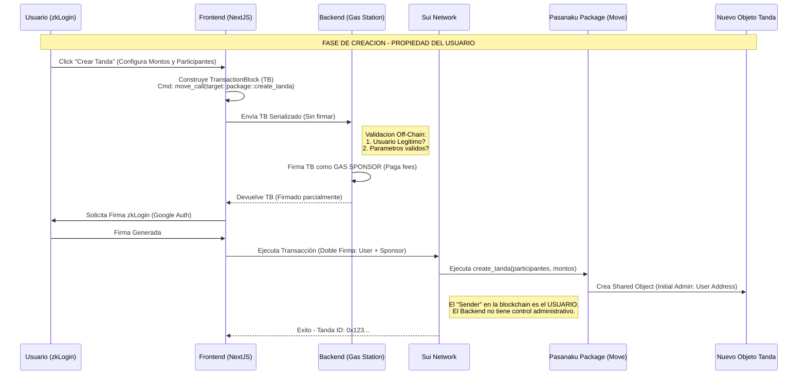

```mermaid
sequenceDiagram
    participant U as Usuario (zkLogin)
    participant FE as Frontend (NextJS)
    participant BE as Backend (Gas Station)
    participant SUI as Sui Network
    participant PKG as Pasanaku Package (Move)
    participant TANDA as Nuevo Objeto Tanda

    Note over U, TANDA: FASE DE CREACION - PROPIEDAD DEL USUARIO

    U->>FE: Click "Crear Tanda" (Configura Montos y Participantes)
    
    FE->>FE: Construye TransactionBlock (TB)<br/>Cmd: move_call(target: package::create_tanda)
    
    FE->>BE: Envía TB Serializado (Sin firmar)
    
    Note right of BE: Validacion Off-Chain:<br/>1. Usuario Legitimo?<br/>2. Parametros validos?
    
    BE->>BE: Firma TB como GAS SPONSOR (Paga fees)
    BE-->>FE: Devuelve TB (Firmado parcialmente)
    
    FE->>U: Solicita Firma zkLogin (Google Auth)
    U->>FE: Firma Generada
    
    FE->>SUI: Ejecuta Transacción (Doble Firma: User + Sponsor)
    
    SUI->>PKG: Ejecuta create_tanda(participantes, montos)
    
    PKG->>TANDA: Crea Shared Object (Initial Admin: User Address)
    
    Note right of SUI: El "Sender" en la blockchain es el USUARIO.<br/>El Backend no tiene control administrativo.
    
    SUI-->>FE: Exito - Tanda ID: 0x123...
```
