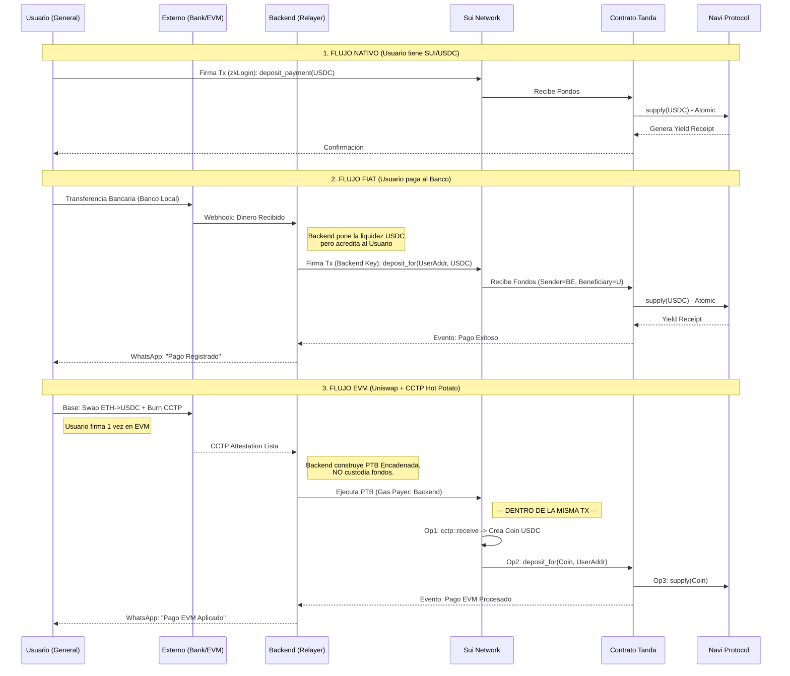

```mermaid
sequenceDiagram
    participant U as Usuario (General)
    participant EXT as Externo (Bank/EVM)
    participant BE as Backend (Relayer)
    participant SUI as Sui Network
    participant TANDA as Contrato Tanda
    participant NAVI as Navi Protocol

    %% --- ESCENARIO 1: PAGO NATIVO (SUI WALLET) ---
    rect rgb(255, 255, 255)
        Note over U, NAVI: 1. FLUJO NATIVO (Usuario tiene SUI/USDC)
        U->>SUI: Firma Tx (zkLogin): deposit_payment(USDC)
        SUI->>TANDA: Recibe Fondos
        TANDA->>NAVI: supply(USDC) - Atomic
        NAVI-->>TANDA: Genera Yield Receipt
        TANDA-->>U: Confirmación
    end

    %% --- ESCENARIO 2: PAGO FIAT (TRANSFERENCIA BANCARIA) ---
    rect rgb(255, 255, 255)
        Note over U, NAVI: 2. FLUJO FIAT (Usuario paga al Banco)
        U->>EXT: Transferencia Bancaria (Banco Local)
        EXT->>BE: Webhook: Dinero Recibido
        
        Note right of BE: Backend pone la liquidez USDC<br/>pero acredita al Usuario
        BE->>SUI: Firma Tx (Backend Key): deposit_for(UserAddr, USDC)
        
        SUI->>TANDA: Recibe Fondos (Sender=BE, Beneficiary=U)
        TANDA->>NAVI: supply(USDC) - Atomic
        NAVI-->>TANDA: Yield Receipt
        TANDA-->>BE: Evento: Pago Exitoso
        BE-->>U: WhatsApp: "Pago Registrado"
    end

    %% --- ESCENARIO 3: PAGO EVM (CROSS-CHAIN / UNISWAP) ---
    rect rgb(255, 255, 255)
        Note over U, NAVI: 3. FLUJO EVM (Uniswap + CCTP Hot Potato)
        U->>EXT: Base: Swap ETH->USDC + Burn CCTP
        Note right of U: Usuario firma 1 vez en EVM
        
        EXT-->>BE: CCTP Attestation Lista
        
        Note right of BE: Backend construye PTB Encadenada.<br/>NO custodia fondos.
        BE->>SUI: Ejecuta PTB (Gas Payer: Backend)
        
        note right of SUI: --- DENTRO DE LA MISMA TX ---
        SUI->>SUI: Op1: cctp::receive -> Crea Coin USDC
        SUI->>TANDA: Op2: deposit_for(Coin, UserAddr)
        TANDA->>NAVI: Op3: supply(Coin)
        
        TANDA-->>BE: Evento: Pago EVM Procesado
        BE-->>U: WhatsApp: "Pago EVM Aplicado"
    end
```