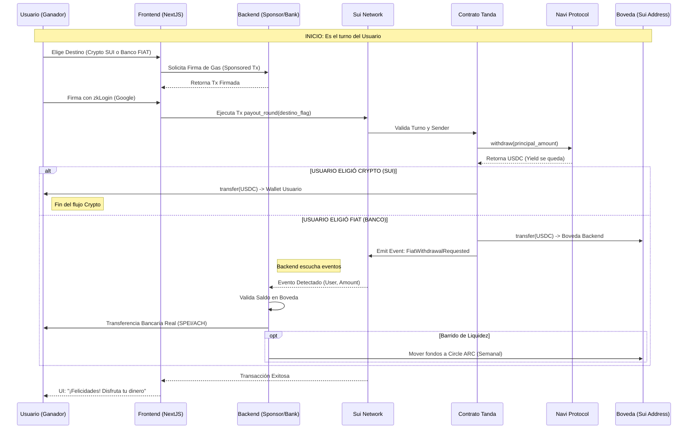

```mermaid
sequenceDiagram
    participant U as Usuario (Ganador)
    participant FE as Frontend (NextJS)
    participant BE as Backend (Sponsor/Bank)
    participant SUI as Sui Network
    participant TANDA as Contrato Tanda
    participant NAVI as Navi Protocol
    participant VAULT as Boveda (Sui Address)

    Note over U, VAULT: INICIO: Es el turno del Usuario

    U->>FE: Elige Destino (Crypto SUI o Banco FIAT)
    
    FE->>BE: Solicita Firma de Gas (Sponsored Tx)
    BE-->>FE: Retorna Tx Firmada
    
    U->>FE: Firma con zkLogin (Google)
    FE->>SUI: Ejecuta Tx payout_round(destino_flag)

    %% --- LÓGICA COMÚN ---
    SUI->>TANDA: Valida Turno y Sender
    TANDA->>NAVI: withdraw(principal_amount)
    NAVI-->>TANDA: Retorna USDC (Yield se queda)

    %% --- BIFURCACIÓN DE DESTINO ---
    alt USUARIO ELIGIÓ CRYPTO (SUI)
        TANDA->>U: transfer(USDC) -> Wallet Usuario
        Note right of U: Fin del flujo Crypto
    else USUARIO ELIGIÓ FIAT (BANCO)
        TANDA->>VAULT: transfer(USDC) -> Boveda Backend
        TANDA->>SUI: Emit Event: FiatWithdrawalRequested
        
        Note right of BE: Backend escucha eventos
        SUI-->>BE: Evento Detectado (User, Amount)
        
        BE->>BE: Valida Saldo en Boveda
        BE->>U: Transferencia Bancaria Real (SPEI/ACH)
        
        opt Barrido de Liquidez
            BE->>VAULT: Mover fondos a Circle ARC (Semanal)
        end
    end
    
    SUI-->>FE: Transacción Exitosa
    FE-->>U: UI: "¡Felicidades! Disfruta tu dinero"
```